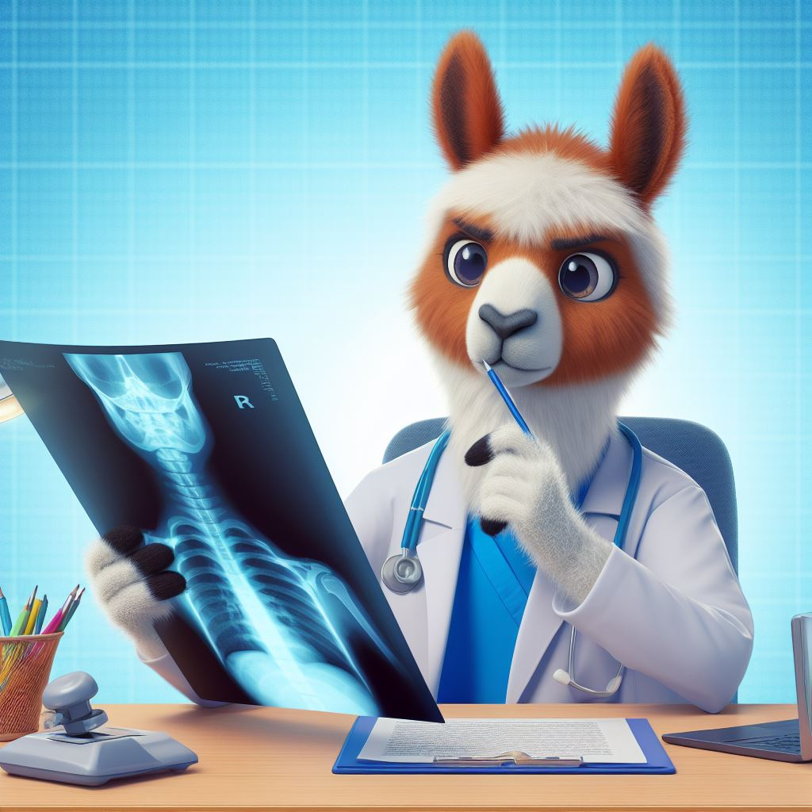

# Clinical Reasoning Enhancement for Chest X-ray Reporting





## 📌 Outline

* [Overview & Highlights](#overview--highlights)
* [Model Zoo](#model-zoo)
* [Quickstart: Inference Guide](#quickstart-inference-guide)
  * [🚀 Inference (Unsloth, 4-bit)](#-inference-unsloth-4-bit)
  * [Gradio Demo](#-gradio-demo-single-file-app)
* [Results (brief)](#results-brief)
* [Project Structure](#project-structure)
* [Citation](#citation)
* [Licenses & Data Access](#licenses--data-access)
* [Disclaimer](#disclaimer)
* [Maintainers](#maintainers)

---

## Overview & Highlights

**RadLLaMA-Thinking** is a radiology-tuned multimodal LLM that generates complete chest X-ray clinical reports. It is trained in two stages:

1. **Large-scale domain tuning** on ~452k image–report pairs (MIMIC-CXR 2.1.0 + CheXpert Plus).
2. **CoT distillation** using a curated 300-sample dataset with **exactly 10 reasoning steps** prepended to the reference report, distilled from strong reasoning teachers.

**Headline numbers (MIMIC-CXR, report generation):**
BLEU-4 **0.143**, ROUGE-L **0.314**, METEOR **0.300**, BERTScore-F1 **0.443**, CheXbert-F1 **0.361**.

**Efficiency**: 4-bit QLoRA adapters (bitsandbytes) + Unsloth; 8-bit AdamW; trained on a single A100 40 GB.

---

## Model Zoo

| Model                           | Params | Quantization | Weights (HF) | Notes                             |
| ------------------------------- | :----: | :----------: | ------------ | --------------------------------- |
| **LLaMA-3.2-Vision (Base)**     |   11B  |   FP16/BF16  | [Link](https://huggingface.co/unsloth/Llama-3.2-11B-Vision-Instruct) | Base vision-language model        |
| **RadLLaMA (Stage-1)**          |   11B  |  4-bit/FP16  | [Link](https://huggingface.co/parsa-mhmdi/RadLLamaThinking) | Domain-tuned on CXR               |
| **RadLLaMA-Thinking (Stage-2)** |   11B  |  4-bit/FP16  | [Link](https://huggingface.co/parsa-mhmdi/RadLLamaThinking_Stage1) | CoT-distilled (Reasoning Model) |

---

## Quickstart: Inference Guide


Awesome—here’s a drop-in **Inference** section tailored to your *working* Unsloth + 4-bit setup, plus a clean Gradio demo.

---

## 🚀 Inference (Unsloth, 4-bit)

> **Import order matters:** import **Unsloth before `transformers`** to avoid optimization warnings.

### 1) Install

```bash
pip install --upgrade unsloth transformers accelerate huggingface_hub bitsandbytes pillow
```

### 2) Download weights (local cache)

```python
from huggingface_hub import snapshot_download

repo_id = "parsa-mhmdi/RadLLamaThinking_Stage1_Final"
local_checkpoint_dir = "./parsa-mhmdi/RadLLamaThinking_Stage1_Final"  # any local path

snapshot_download(
    repo_id=repo_id,
    local_dir=local_checkpoint_dir,
    repo_type="model",
)
```

> Optional (download only specific files): add `allow_patterns=["*.json","*.safetensors","*model*","*tokenizer*"]`.

### 3) Load the model (4-bit, Unsloth Vision)

```python
from unsloth import FastVisionModel  # FastLanguageModel is for text-only LLMs
import torch

local_checkpoint_dir = "./parsa-mhmdi/RadLLamaThinking_Stage1_Final"

model, tokenizer = FastVisionModel.from_pretrained(
    local_checkpoint_dir,
    max_seq_length=2048,
    load_in_4bit=True,                  # 4-bit PEFT/merged checkpoints
    use_gradient_checkpointing="unsloth",
)
```

### 4) Inference on your dataset sample (CombinedChestXRDataset)

```python
from unsloth import FastVisionModel
from transformers import TextStreamer

# 1) Put the vision model in inference mode (important)
FastVisionModel.for_inference(model)
model.eval()

# 2) Pick a sample from your test split
sample = test_chex[100]   # or: sample = test_mim[100]

# 3) Extract PIL image + instruction text from the Unsloth-style messages
user_turn    = sample["messages"][0]
user_content = user_turn["content"]

image = None
instruction_text = None
for part in user_content:
    if part.get("type") == "image":
        image = part.get("image")           # PIL.Image
    elif part.get("type") == "text":
        instruction_text = part.get("text") # the same instruction used during training

assert image is not None, "No image found in messages[0].content"
assert instruction_text is not None, "No text instruction found in messages[0].content"

# 4) Build user message (image placeholder + text)
gen_messages = [
    {
        "role": "user",
        "content": [
            {"type": "image"},                          # placeholder; actual pixels passed below
            {"type": "text", "text": instruction_text}, # keep the SAME schema you trained with
        ],
    }
]

# 5) Turn chat to a prompt string
input_text = tokenizer.apply_chat_template(
    gen_messages,
    add_generation_prompt=True
)

# 6) Tokenize image + text together
inputs = tokenizer(
    image,
    input_text,
    add_special_tokens=False,     # required for Unsloth’s chat template
    return_tensors="pt",
).to("cuda")

# 7) (Optional) stream to stdout
streamer = TextStreamer(tokenizer, skip_prompt=True)

# 8) Generate
_ = model.generate(
    **inputs,
    streamer=streamer,
    max_new_tokens=256,
    use_cache=True,
    temperature=0.7,
    top_p=0.9,
)
```

### 5) Inference from a raw image (no dataset object)

```python
from PIL import Image
from transformers import TextStreamer

FastVisionModel.for_inference(model)
model.eval()

image = Image.open("path/to/cxr.png").convert("RGB")
instruction_text = (
    "You are a board-certified radiologist. Generate a concise RSNA/ACR-style "
    "report with EXACTLY these headers: Technique, View, Findings, Impression. "
    "Base all statements only on the image; handle uncertainty explicitly."
)

gen_messages = [
    {"role": "user",
     "content": [
         {"type": "image"},
         {"type": "text", "text": instruction_text},
     ]}
]

input_text = tokenizer.apply_chat_template(gen_messages, add_generation_prompt=True)
inputs = tokenizer(image, input_text, add_special_tokens=False, return_tensors="pt").to("cuda")

streamer = TextStreamer(tokenizer, skip_prompt=True)
_ = model.generate(
    **inputs,
    streamer=streamer,
    max_new_tokens=512,
    temperature=0.7,
    top_p=0.9,
    use_cache=True,
)
```

---

## 🌐 Gradio Demo (single-file app)

> Runs your local checkpoint with image upload + custom instruction.
> For CUDA/4-bit you need an NVIDIA GPU; for CPU fallback set `load_in_4bit=False` and remove `.to("cuda")` calls (will be slower).

```python
# app.py
import gradio as gr
from PIL import Image
import torch
from unsloth import FastVisionModel

MODEL_DIR = "./parsa-mhmdi/RadLLamaThinking_Stage1_Final"

# ---- Load once at startup ----
model, tokenizer = FastVisionModel.from_pretrained(
    MODEL_DIR,
    max_seq_length=2048,
    load_in_4bit=True,
    use_gradient_checkpointing="unsloth",
)
FastVisionModel.for_inference(model)
model.eval()

DEVICE = "cuda" if torch.cuda.is_available() else "cpu"

DEFAULT_PROMPT = (
    "You are a board-certified radiologist specialized in adult chest radiography. "
    "Generate a concise clinical report with EXACTLY these headers in order: "
    "Technique, View, Findings, Impression. Base every statement only on the image; "
    "handle uncertainty explicitly; avoid hallucinations."
)

def generate_report(image: Image.Image, instruction: str, max_new_tokens: int, temperature: float, top_p: float):
    if image is None:
        return "Please upload a CXR image."
    if not instruction or instruction.strip() == "":
        instruction = DEFAULT_PROMPT

    gen_messages = [
        {
            "role": "user",
            "content": [
                {"type": "image"},
                {"type": "text", "text": instruction},
            ],
        }
    ]

    prompt = tokenizer.apply_chat_template(gen_messages, add_generation_prompt=True)
    inputs = tokenizer(
        image,
        prompt,
        add_special_tokens=False,
        return_tensors="pt",
    )

    if DEVICE == "cuda":
        inputs = {k: v.to(DEVICE) for k, v in inputs.items()}

    with torch.inference_mode():
        out = model.generate(
            **inputs,
            max_new_tokens=int(max_new_tokens),
            temperature=float(temperature),
            top_p=float(top_p),
            use_cache=True,
            do_sample=(temperature > 0.0),
        )

    # Strip the prompt tokens for clean output
    gen_only = out[:, inputs["input_ids"].shape[-1]:]
    text = tokenizer.batch_decode(gen_only, skip_special_tokens=True)[0]
    return text

with gr.Blocks(title="RadLLaMA-Thinking Inference") as demo:
    gr.Markdown("## RadLLaMA(-Thinking) — Chest X-ray Report Generation")
    with gr.Row():
        with gr.Column():
            img = gr.Image(type="pil", label="Chest X-ray (PNG/JPG)")
            instr = gr.Textbox(label="Instruction", value=DEFAULT_PROMPT, lines=5)
            max_tokens = gr.Slider(64, 1024, value=512, step=32, label="max_new_tokens")
            temp = gr.Slider(0.0, 1.2, value=0.7, step=0.05, label="temperature")
            top_p = gr.Slider(0.1, 1.0, value=0.9, step=0.05, label="top_p")
            btn = gr.Button("Generate Report")
        with gr.Column():
            out = gr.Textbox(label="Model Output", lines=24)

    btn.click(fn=generate_report, inputs=[img, instr, max_tokens, temp, top_p], outputs=out)

if __name__ == "__main__":
    demo.queue().launch()
```

Run it:

```bash
python app.py
```

> **Switching models**: to test Stage-2 / Thinking, just point `MODEL_DIR` to your other local folder or replace with the correct HF snapshot path.
---

## Results (brief)

* **CheXpert Plus (report generation)**: after CoT distillation, RadLLaMA-Thinking outperforms the base and stage-1 models across BLEU-4, ROUGE-L, METEOR, BERTScore, and CheXbert-F1.
* **MIMIC-CXR (report generation)**: RadLLaMA-Thinking achieves **BLEU-4 0.143**, **ROUGE-L 0.314**, **METEOR 0.300**, **BERTScore-F1 0.443**, **CheXbert-F1 0.361**.

> Full tables/plots are in the paper and the `results/` folder (add if you plan to commit them).

---

## Project Structure

```
.
├─ README.md
├─ Images/
├─ RadLLaMAThinking_Download_Data.ipynb
├─ RadLLaMAThinking_Train_CoTReasoning.ipynb
├─ RadLLaMAThinking_Train_LargeScale.ipynb
.
```

* **RadLLaMAThinking_Download_Data.ipynb** — notebook for downloading the MIMIC-CXR and CheXpert Plus datasets.
* **RadLLaMAThinking_Train_LargeScale.ipynb** — notebook for loading the combined dataset and performing large-scale training.
* **RadLLaMAThinking_Train_CoTReasoning.ipynb** — notebook for loading the CXR CoT Reasoning dataset and fine-tuning with reasoning supervision.

---

## Citation

If you use this repository, models, or datasets in your research, please cite:

```bibtex


```

---

## Licenses & Data Access

* **Models & Code**: Apache-2.0.
* **MIMIC-CXR / CheXpert Plus**: require credentialed access and adherence to their data use agreements. **We do not redistribute images or PHI.**
* **Intended Use**: research and education.

---

## Disclaimer

This software and its models **do not** provide medical advice and **must not** be used for autonomous clinical decision making. Always involve a licensed radiologist for interpretation and reporting.

---

### Maintainers

* **Parsa Mohammadi** — Amirkabir University of Technology

For questions, please open a GitHub issue or discussion in this repo.
